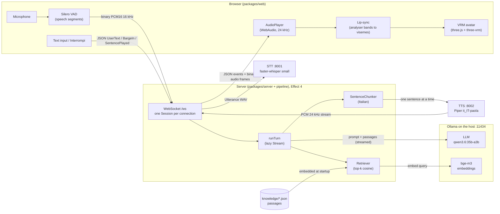
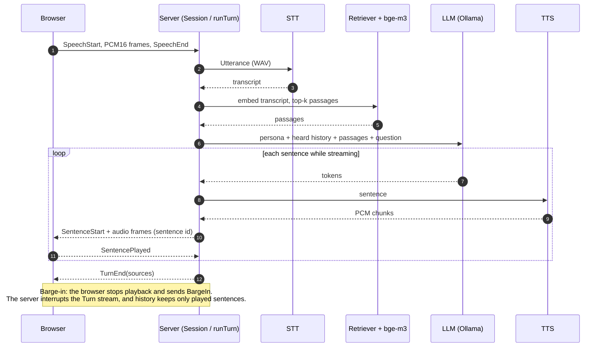

# System diagram

## Components

```mermaid
flowchart LR
  subgraph Browser["Browser (packages/web)"]
    Mic["Microphone"] --> VAD["Silero VAD<br/>(speech segments)"]
    UI["Text input / Interrompi"]
    Player["AudioPlayer<br/>(WebAudio, 24 kHz)"]
    Lip["Lip-sync<br/>(analyser bands to visemes)"]
    VRM["VRM avatar<br/>(three.js + three-vrm)"]
    Player --> Lip --> VRM
  end

  subgraph Server["Server (packages/server + pipeline), Effect 4"]
    WS["WebSocket /ws<br/>one Session per connection"]
    Turn["runTurn<br/>(lazy Stream)"]
    Chunk["SentenceChunker<br/>(Italian)"]
    Ret["Retriever<br/>(top-k cosine)"]
    WS --> Turn
    Turn --> Ret
    Turn --> Chunk
  end

  KB[("knowledge/*.json<br/>passages")]
  STT["STT :8001<br/>faster-whisper small"]
  TTS["TTS :8002<br/>Piper it_IT-paola"]
  subgraph Ollama["Ollama on the host :11434"]
    LLM["LLM<br/>qwen3.6:35b-a3b"]
    Emb["bge-m3<br/>embeddings"]
  end

  VAD -- "binary PCM16 16 kHz" --> WS
  UI -- "JSON UserText / BargeIn / SentencePlayed" --> WS
  WS -- "JSON events + binary audio frames" --> Player

  WS -- "Utterance WAV" --> STT
  Ret -- "embed query" --> Emb
  KB -- "embedded at startup" --> Ret
  Turn -- "prompt + passages (streamed)" --> LLM
  Chunk -- "one sentence at a time" --> TTS
  TTS -- "PCM 24 kHz stream" --> WS
```

## One turn

```mermaid
sequenceDiagram
  autonumber
  participant B as Browser
  participant S as Server (Session / runTurn)
  participant T as STT
  participant R as Retriever + bge-m3
  participant L as LLM (Ollama)
  participant V as TTS

  B->>S: SpeechStart, PCM16 frames, SpeechEnd
  S->>T: Utterance (WAV)
  T-->>S: transcript
  S->>R: embed transcript, top-k passages
  R-->>S: passages
  S->>L: persona + heard history + passages + question
  loop each sentence while streaming
    L-->>S: tokens
    S->>V: sentence
    V-->>S: PCM chunks
    S-->>B: SentenceStart + audio frames (sentence id)
    B-->>S: SentencePlayed
  end
  S-->>B: TurnEnd(sources)
  Note over B,S: Barge-in: the browser stops playback and sends BargeIn.<br/>The server interrupts the Turn stream, and history keeps only played sentences.
```
